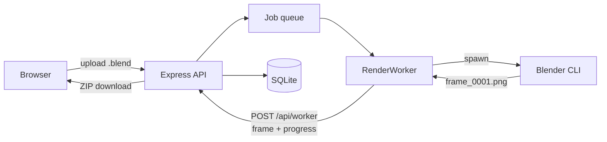

# RenderNet

[](https://github.com/Vishrut2403/RenderNet/actions/workflows/ci.yml)

A self-hosted Blender render farm for a shared workstation. One machine does the rendering; everyone else submits `.blend` files and collects finished frames from a browser, with nothing to install.



The renderer runs as a separate `RenderWorker` reporting back over HTTP rather than through in-process callbacks — the same boundary a worker on another machine would use. Jobs are tracked frame by frame in SQLite, so a render interrupted by the machine being switched off resumes at the frames it never delivered instead of starting over.

---

## Setting up the workstation

Needs **Node.js 22 or newer** and **Blender**. Not 20, even though it is still LTS: `better-sqlite3` publishes no prebuilt binary for Node 20, so installing it compiles from source and needs a C++ toolchain — on Windows that means Visual Studio with the Desktop C++ workload. On 22 and 24 the binary is downloaded and nothing is built.

**1. Build it**

```bash
git clone https://github.com/Vishrut2403/RenderNet.git
cd RenderNet/backend && npm install
cd ../frontend && npm install && npm run build
```

The frontend build is what lets clients get away with only a browser — the API serves `frontend/dist` itself. Rebuild after changing frontend code.

**2. Write `backend/.env`**

```env
PORT=5500
WORKER_SECRET=paste-a-long-random-string
SIGNUP_CODE=what-you-tell-your-team
BLENDER_PATH=C:\Program Files\Blender Foundation\Blender 5.2\blender.exe
CYCLES_DEVICE=CUDA
```

`backend/.env.example` is the same file with every option and its default in
it; copy that rather than typing this out.

Generate the secret with:

```bash
node -e "console.log(require('crypto').randomBytes(32).toString('hex'))"
```

`BLENDER_PATH` is required on Windows, where Blender is not on `PATH` — match the
version folder actually installed. On Linux and macOS it can be omitted if
`blender` is on `PATH`. Drop `CYCLES_DEVICE` without an NVIDIA card, or use
`OPTIX` on RTX.

**Without `SIGNUP_CODE` nobody can create an account.** That is deliberate —
anyone who can reach the port could otherwise sign up — but it does have to be set
before your team can register.

**3. Start it and read the output**

```bash
cd ../backend && npm start
```

All three lines matter; they tell you whether step 2 worked:

```
Blender found: /usr/bin/blender
    Port: 5500  , BlenderPath: Found
    Data:  /home/you/RenderNet/backend
    UI:    http://localhost:5500
```

**4. Take the admin account**

Open the UI and sign in as `admin` / `admin123`. It immediately requires a new
password and refuses everything else until one is set — that is the intended path,
not a fault. The same applies to anyone whose password an admin resets later.

Five wrong passwords lock a username out for fifteen minutes; restarting the
server clears it.

---

## Windows: three settings and a startup task

**Open the port**, or nobody else can connect. As administrator:

```
netsh advfirewall firewall add rule name="RenderNet" dir=in action=allow protocol=TCP localport=5500
```

**Stop it sleeping** mid-render:

```
powercfg /change standby-timeout-ac 0
powercfg /change hibernate-timeout-ac 0
```

**Rename the PC** to something like `RENDERNET`, so people can use
`http://rendernet:5500` rather than chasing a DHCP address.

**Start on boot** — Task Scheduler, Create Task:

| Field | Value |
| --- | --- |
| Trigger | At log on |
| Action | Start a program |
| Program | `C:\Program Files\nodejs\node.exe` |
| Arguments | `C:\RenderNet\backend\src\index.js` |
| Settings | tick *If the task fails, restart every 1 minute* |

Use `node.exe` rather than `npm`, which is a `.cmd` wrapper and behaves awkwardly
under Task Scheduler. *At log on* rather than *At startup* keeps the server in the
interactive session, where GPU rendering behaves as it does when Blender is
launched by hand. The working directory does not matter: data paths and `.env` are
resolved from the source tree, not from wherever the task starts.

The database is snapshotted to `backups/` on every start, keeping the last
seven.

Nothing reads that window, so everything printed also goes to a dated file in
`logs/` under the data directory, kept for a month, along with a line per
request recording who did what. The job list the dashboard polls is left out, or
it would be the whole file. An admin can read them from the
Logs entry in the account menu, or over the API: `GET /api/logs` lists them,
`GET /api/logs/<name>` returns the last 200 lines, `?lines=1000` for more.

---

## Setting up a client

Nothing to install.

1. Open `http://rendernet:5500`
2. **Create account** — username, password, and the signup code
3. Sign in and upload a `.blend`

Jobs belong to the account rather than the machine, so someone can submit from one
computer and download from another.

To confirm the workstation is reachable, open `http://rendernet:5500/api/health`
from a *different* machine. `{"status":"ok","blenderAvailable":true}` means the
firewall rule and the name are both working. It answers `degraded` instead when
Blender is missing or the disk is too full to render, and signing in first adds
the queue depth, the free disk, every job in flight with the worker holding each
frame, and the last failure — one URL that answers "is the farm actually
working?" rather than "is the process up?".

---

## Behaviour worth knowing

Things that would otherwise surprise you.

- **An interrupted render resumes rather than restarting.** Frames are tracked
  individually, so switching the machine off mid-job costs the frame in flight,
  not the evening. A job is only given up on if it is interrupted repeatedly
  *without ever completing a frame*.
- **A failed frame gets three attempts**, since causes like a momentary memory
  shortage rarely repeat. But a job whose first three frames all fail stops
  immediately instead of working through the range.
- **Renderers are separate processes.** The server starts `WORKER_SLOTS` of
  them and restarts any that die. They share whichever jobs are running, and a
  worker with nothing left to claim starts the next queued job rather than
  waiting, so the tail of one job does not leave the rest of the farm idle.
  A second machine joins by running `npm run worker` against the same API with
  the same `WORKER_SECRET`: it downloads each scene over HTTP and renders in
  its own scratch space. Nothing on the server has to know it is there.
- **Frames are claimed, not handed out.** A worker asks for one frame at a time
  and holds a claim on it with an expiry, renewed while the frame renders. A
  worker that dies loses its claim and the frame returns to circulation, and a
  frame can only be uploaded by whoever holds the claim on it. The server, not
  the worker, decides when a job is finished: only the frames on disk are
  downloadable, and a worker that died halfway is in no position to report.
- **Each user holds 10 GB** across uploads and frames, and is expected to delete
  finished jobs once downloaded. The 14-day sweep is a backstop, not the limit.
  Anything still queued or rendering is never swept, however old.
- **Any user can mark a job urgent**, which pauses whatever is rendering. The
  paused job keeps its finished frames and carries on afterwards, and both cards
  say what happened — visible rather than restricted.
- **A job card shows the last frame rendered while it is still rendering**, so a
  scene that came out wrong is caught at frame 30 rather than at frame 500.
- **A queued job is told roughly when it will start**, not just its position.
  Every frame's render time is recorded, so the estimate is the median of what
  frames have actually cost on this machine, shared out between the workers
  running. A finished job also reports its typical and slowest frame.
- **Several output formats can be ticked at once.** Blender renders the frame
  once and writes each one, so a second format costs disk rather than time, and
  they all arrive in the same ZIP. The first of them is what previews show,
  which is why a browser-friendly one sorts ahead of OpenEXR.
- **Rerunning a job retries only the frames that failed**, keeping the ones that
  worked. The uploaded `.blend` is reused, so nothing is uploaded twice.
- **Resolution and Cycles samples can be overridden at submit time**, for a
  cheap test pass without editing the scene. Blender has no flag for either, so
  they are applied to the loaded scene before the frame is rendered.
- **The disk itself is guarded, not just each person's share.** Below
  `MIN_FREE_BYTES` uploads are refused and queued work is held rather than
  failed, because deleting one finished job is all it takes to free it.
- **The browser can notify you when a job lands**, since people submit in the
  evening and rarely watch the tab. It asks the first time you queue something.
- **Cancelling deletes that job's files.** Uploads are capped at 500MB and 2000
  frames; engines are `CYCLES`, `BLENDER_EEVEE` and `BLENDER_WORKBENCH`, and
  output formats are PNG, JPEG and OpenEXR.

One thing it does not do: the frontend has no automated tests in the repo.

---

## Configuration

Environment variables, read from `backend/.env`. It is resolved from the source
tree, so it is found however the server is started.

| Variable | Default | Purpose |
| --- | --- | --- |
| `PORT` | `5500` | API and UI listen port |
| `SIGNUP_CODE` | *unset* | Code required to create an account. While unset, account creation is refused rather than left open. |
| `WORKER_SECRET` | *generated per process* | Authenticates worker callbacks. Must be set explicitly for workers on other machines. |
| `BLENDER_PATH` | auto-detected | Blender executable. Required on Windows. |
| `CYCLES_DEVICE` | `CPU` | `CPU`, `CUDA`, `OPTIX`, `HIP`, `ONEAPI` or `METAL` |
| `DATA_DIR` | the `backend/` directory | Where uploads, renders, scratch space and the database live |
| `USER_QUOTA_BYTES` | `10737418240` (10 GB) | Disk each user may hold in uploads and rendered frames |
| `RETENTION_DAYS` | `14` | Backstop sweep for files nobody came back for |
| `MIN_FREE_BYTES` | `5368709120` (5 GB) | Disk kept spare; below it uploads are refused and the queue holds |
| `DB_BACKUPS_KEPT` | `7` | Database snapshots kept in `backups/`, one taken per start |
| `LOG_RETENTION_DAYS` | `30` | How long dated logs in `logs/` are kept |
| `MAX_LOG_BYTES` | `8388608` (8 MB) | Size at which the day's log rotates to a new file |
| `DB_PATH` | `rendernet.db` inside `DATA_DIR` | SQLite database file |
| `API_URL` | `http://localhost:5500` | Base URL the worker posts results back to |
| `WORKER_SLOTS` | `1` | Renderers this machine runs, each its own process. `0` coordinates only |
| `WORKER_REMOTE` | *unset* | Set to `1` on a worker not on the server's machine |
| `WORKER_SCRATCH_DIR` | a temp directory | Where a remote worker keeps scenes and frames |
| `LEASE_TTL_MS` | `120000` | How long a worker's claim on a frame lasts before another may take it |

---

## Development

```bash
cd frontend && npm run dev     # Vite on :8080, proxies /api to the backend
cd backend  && npm test        # 332 checks
npm run lint                   # from the root, covers both packages
```

Set `VITE_PROXY_TARGET=http://host:5500` to point the dev server at a backend
elsewhere. Tests run in temporary directories with their own databases and never
touch real uploads, renders or accounts; render-dependent checks are skipped when
Blender is absent, leaving 310 of the 332 still meaningful.

CI runs the whole suite on Linux and Windows against Node 22 and 24, which is the
only place it is exercised on the platform the workstation actually runs. Windows
differs where it matters most: it has no signals, so cancelling a render means
killing a process tree with `taskkill` rather than escalating SIGTERM to SIGKILL.
That path and the quoting that carries a Blender path through `cmd.exe` are also
checked directly from any OS, so a mistake in either shows up before CI does.

---

Built as an individual portfolio project. Feedback and suggestions are welcome.
