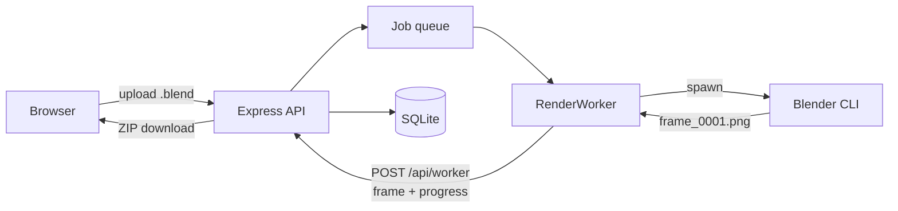

# RenderNet

A self-hosted Blender render farm for a shared workstation. One machine does the rendering; everyone else submits `.blend` files and collects finished frames from a browser, with nothing to install.



The renderer runs as a separate `RenderWorker` reporting back over HTTP rather than through in-process callbacks — the same boundary a worker on another machine would use. Jobs are tracked frame by frame in SQLite, so a render interrupted by the machine being switched off resumes at the frames it never delivered instead of starting over.

---

## Setting up the workstation

Needs **Node.js LTS** and **Blender**. Use an LTS Node release: `better-sqlite3` and `bcrypt` ship prebuilt binaries per Node version, and a mismatch forces a compile that needs a C++ toolchain.

**1. Build it**

```bash
git clone https://github.com/Vishrut2403/RenderNet.git
cd RenderNet/backend && npm install
cd ../frontend && npm install && npm run build
```

The frontend build is what lets clients get away with only a browser — the API serves `frontend/dist` itself. Rebuild after changing frontend code.

**2. Write `backend/.env`**

```env
PORT=5500
WORKER_SECRET=paste-a-long-random-string
SIGNUP_CODE=what-you-tell-your-team
BLENDER_PATH=C:\Program Files\Blender Foundation\Blender 4.2\blender.exe
CYCLES_DEVICE=CUDA
```

Generate the secret with:

```bash
node -e "console.log(require('crypto').randomBytes(32).toString('hex'))"
```

`BLENDER_PATH` is required on Windows, where Blender is not on `PATH` — match the
version folder actually installed. On Linux and macOS it can be omitted if
`blender` is on `PATH`. Drop `CYCLES_DEVICE` without an NVIDIA card, or use
`OPTIX` on RTX.

**Without `SIGNUP_CODE` nobody can create an account.** That is deliberate —
anyone who can reach the port could otherwise sign up — but it does have to be set
before your team can register.

**3. Start it and read the output**

```bash
cd ../backend && npm start
```

All three lines matter; they tell you whether step 2 worked:

```
Blender found: /usr/bin/blender
    Port: 5500  , BlenderPath: Found
    Data:  /home/you/RenderNet/backend
    UI:    http://localhost:5500
```

**4. Take the admin account**

Open the UI and sign in as `admin` / `admin123`. It immediately requires a new
password and refuses everything else until one is set — that is the intended path,
not a fault. The same applies to anyone whose password an admin resets later.

---

## Windows: three settings and a startup task

**Open the port**, or nobody else can connect. As administrator:

```
netsh advfirewall firewall add rule name="RenderNet" dir=in action=allow protocol=TCP localport=5500
```

**Stop it sleeping** mid-render:

```
powercfg /change standby-timeout-ac 0
powercfg /change hibernate-timeout-ac 0
```

**Rename the PC** to something like `RENDERNET`, so people can use
`http://rendernet:5500` rather than chasing a DHCP address.

**Start on boot** — Task Scheduler, Create Task:

| Field | Value |
| --- | --- |
| Trigger | At log on |
| Action | Start a program |
| Program | `C:\Program Files\nodejs\node.exe` |
| Arguments | `C:\RenderNet\backend\src\index.js` |
| Settings | tick *If the task fails, restart every 1 minute* |

Use `node.exe` rather than `npm`, which is a `.cmd` wrapper and behaves awkwardly
under Task Scheduler. *At log on* rather than *At startup* keeps the server in the
interactive session, where GPU rendering behaves as it does when Blender is
launched by hand. The working directory does not matter: data paths and `.env` are
resolved from the source tree, not from wherever the task starts.

---

## Setting up a client

Nothing to install.

1. Open `http://rendernet:5500`
2. **Create account** — username, password, and the signup code
3. Sign in and upload a `.blend`

Jobs belong to the account rather than the machine, so someone can submit from one
computer and download from another.

To confirm the workstation is reachable, open `http://rendernet:5500/api/health`
from a *different* machine. `{"status":"ok","blenderAvailable":true}` means the
firewall rule and the name are both working.

---

## Behaviour worth knowing

Things that would otherwise surprise you.

- **An interrupted render resumes rather than restarting.** Frames are tracked
  individually, so switching the machine off mid-job costs the frame in flight,
  not the evening. A job is only given up on if it is interrupted repeatedly
  *without ever completing a frame*.
- **A failed frame gets three attempts**, since causes like a momentary memory
  shortage rarely repeat. But a job whose first three frames all fail stops
  immediately instead of working through the range.
- **Each user holds 5 GB** across uploads and frames, and is expected to delete
  finished jobs once downloaded. The 14-day sweep is a backstop, not the limit.
  Anything still queued or rendering is never swept, however old.
- **Any user can mark a job urgent**, which pauses whatever is rendering. The
  paused job keeps its finished frames and carries on afterwards, and both cards
  say what happened — visible rather than restricted.
- **Cancelling deletes that job's files.** Uploads are capped at 500MB and 2000
  frames; engines are `CYCLES`, `BLENDER_EEVEE` and `BLENDER_WORKBENCH`.

Two things it does not do: renders run strictly one at a time, and the frontend
has no automated tests in the repo.

---

## Configuration

Environment variables, read from `backend/.env`. It is resolved from the source
tree, so it is found however the server is started.

| Variable | Default | Purpose |
| --- | --- | --- |
| `PORT` | `5500` | API and UI listen port |
| `SIGNUP_CODE` | *unset* | Code required to create an account. While unset, account creation is refused rather than left open. |
| `WORKER_SECRET` | *generated per process* | Authenticates worker callbacks. Must be set explicitly for workers on other machines. |
| `BLENDER_PATH` | auto-detected | Blender executable. Required on Windows. |
| `CYCLES_DEVICE` | `CPU` | `CPU`, `CUDA`, `OPTIX`, `HIP`, `ONEAPI` or `METAL` |
| `DATA_DIR` | the `backend/` directory | Where uploads, renders, scratch space and the database live |
| `USER_QUOTA_BYTES` | `5368709120` (5 GB) | Disk each user may hold in uploads and rendered frames |
| `RETENTION_DAYS` | `14` | Backstop sweep for files nobody came back for |
| `DB_PATH` | `rendernet.db` inside `DATA_DIR` | SQLite database file |
| `API_URL` | `http://localhost:5500` | Base URL the worker posts results back to |

---

## Development

```bash
cd frontend && npm run dev     # Vite on :8080, proxies /api to the backend
cd backend  && npm test        # 135 checks
```

Set `VITE_PROXY_TARGET=http://host:5500` to point the dev server at a backend
elsewhere. Tests run in temporary directories with their own databases and never
touch real uploads, renders or accounts; render-dependent checks are skipped when
Blender is absent, leaving 122 of the 135 still meaningful.

---

Built as an individual portfolio project. Feedback and suggestions are welcome.
