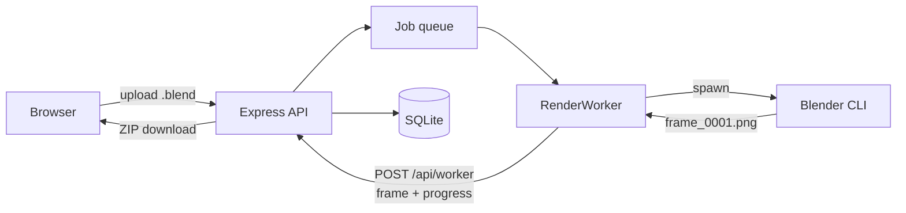

# RenderNet

[](https://github.com/Vishrut2403/RenderNet/actions/workflows/ci.yml)

A self-hosted Blender render farm for a shared workstation. One machine does the rendering; everyone else submits `.blend` files and collects finished frames from a browser, with nothing to install.



The renderer runs as a separate `RenderWorker` reporting back over HTTP rather than through in-process callbacks — the same boundary a worker on another machine would use.

<!-- Screenshots: drop them in here as  once taken.
     tools/demo/ builds a scene and fills a farm with jobs to photograph. -->

---

## What it does

- Takes a `.blend` from a browser — engine, frame range, resolution, samples,
  output formats — and hands the frames back as a ZIP or as a video.
- Spreads a job across as many machines as you point at it, a frame at a time.
- Splits a single heavy still into tiles rendered at once and puts it back together.
- Renders one frame first and holds the rest until its owner approves it.
- Opens a scene before queueing it to see whether it brought its textures.
- Survives the workstation being switched off mid-render.
- Accounts, per-user disk quotas, per-machine credentials, scoped download
  links, and HTTPS when you give it a certificate.

---

## How it works

The parts that took the most thought.

**Frames are claimed, not handed out.** A worker asks for one frame and holds a
claim on it with an expiry, renewed while it renders. A worker that dies loses
the claim and the frame returns to circulation; a frame can only be uploaded by
whoever holds the claim on it. The server, not the worker, decides when a job is
done — only the frames on disk are downloadable, and a worker that died halfway
is in no position to report.

**An interrupted render resumes rather than restarting.** Frames are tracked
individually, so switching the machine off mid-job costs the frame in flight,
not the evening. A job is only given up on if it is interrupted repeatedly
*without ever completing a frame*.

**Renderers are separate processes.** The server starts `WORKER_SLOTS` of them
and restarts any that die. A worker with nothing left to claim starts the next
queued job rather than waiting, so the tail of one job does not leave the farm
idle. A second machine joins by running `npm run worker` against the same API:
it downloads each scene over HTTP and renders in its own scratch space. Every
worker says which engines it offers, and is passed over for jobs using anything
else — otherwise a machine that cannot render a job's engine would take its
frames, fail every attempt, and stop the job for everybody.

**Every machine renders under its own credential.** The workstation mints one
for itself at each start, so it needs nothing configured; every other machine is
issued one that is shown once and can be revoked on its own. A machine may only
touch the claims it holds, and may only download the scenes it is rendering.

**A heavy still can be split across machines.** A single frame submitted in
tiles is cut into regions, each claimed and rendered like any other unit of
work, and Blender puts them back into one image once they have all arrived. It
only pays off with more than one machine free: splitting a still on one
workstation is the same work with more steps.

**A test frame can be rendered first.** The rest of the range is held back until
its owner has looked at that frame and approved it, so a wrong camera or a
missing material costs one frame rather than five hundred. The farm renders
whatever is queued behind it while it waits.

**The list is paged and big uploads are chunked.** Jobs are read twenty-five at
a time through a cursor on the job id rather than an offset, so a job arriving
mid-scroll cannot push a row into view twice; the filter counts are worked out
over every job, so they stay right whatever is on screen. A file over 32MB goes
up in pieces, each answered with how much the server now holds, so a transfer
that dies carries on from that byte.

---

## Setting up the workstation

Needs **Node.js 22 or newer** and **Blender**. Not 20, even though it is still LTS: `better-sqlite3` publishes no prebuilt binary for Node 20, so installing it compiles from source and needs a C++ toolchain — on Windows that means Visual Studio with the Desktop C++ workload. On 22 and 24 the binary is downloaded and nothing is built.

**1. Build it**

```bash
git clone https://github.com/Vishrut2403/RenderNet.git
cd RenderNet/backend && npm install
cd ../frontend && npm install && npm run build
```

The frontend build is what lets clients get away with only a browser — the API serves `frontend/dist` itself. Rebuild after changing frontend code.

**2. Write `backend/.env`**

```env
PORT=5500
SIGNUP_CODE=what-you-tell-your-team
BLENDER_PATH=C:\Program Files\Blender Foundation\Blender 5.2\blender.exe
CYCLES_DEVICE=CUDA
```

Copy `backend/.env.example`, which carries every option and its default, rather
than typing this out. `BLENDER_PATH` is required on Windows and optional
wherever `blender` is on `PATH`; drop `CYCLES_DEVICE` without an NVIDIA card, or
use `OPTIX` on RTX.

**Without `SIGNUP_CODE` nobody can create an account** — deliberate, since
anyone who can reach the port could otherwise sign up, but it has to be set
before your team can register.

**3. Start it** with `npm start` from `backend/`. The output tells you whether
step 2 worked — it names the Blender it found, the data directory and the URL.

**4. Take the admin account.** Sign in as `admin` / `admin123`. It immediately
requires a new password and refuses everything else until one is set — that is
the intended path, not a fault, and the same applies to anyone whose password an
admin resets later. Five wrong passwords lock a username out for fifteen
minutes; restarting the server clears it.

---

## Windows: three settings and a startup task

**Open the port**, or nobody else can connect. As administrator:

```
netsh advfirewall firewall add rule name="RenderNet" dir=in action=allow protocol=TCP localport=5500
```

**Stop it sleeping** mid-render:

```
powercfg /change standby-timeout-ac 0
powercfg /change hibernate-timeout-ac 0
```

**Rename the PC** to something like `RENDERNET`, so people can use
`http://rendernet:5500` rather than chasing a DHCP address.

**Start on boot** — Task Scheduler, Create Task:

| Field | Value |
| --- | --- |
| Trigger | At log on |
| Action | Start a program |
| Program | `C:\Program Files\nodejs\node.exe` |
| Arguments | `C:\RenderNet\backend\src\index.js` |
| Settings | tick *If the task fails, restart every 1 minute* |

Use `node.exe` rather than `npm`, a `.cmd` wrapper that behaves awkwardly under
Task Scheduler, and *At log on* rather than *At startup*, which keeps the server
in the interactive session where GPU rendering behaves as it does by hand. The
working directory does not matter: data paths and `.env` resolve from the source
tree. The database is snapshotted to `backups/` on every start, keeping seven.

Nothing reads that window, so everything printed also goes to a dated file in
`logs/` under the data directory, kept for a month, with a line per request
recording who did what. The job list the dashboard polls is left out, or it
would be the whole file. An admin reads them from the Logs entry in the account
menu, or over the API at `GET /api/logs`.

---

## Setting up a client

Nothing to install.

1. Open `http://rendernet:5500`
2. **Create account** — username, password, and the signup code
3. Sign in and upload a `.blend`

Jobs belong to the account rather than the machine, so someone can submit from one
computer and download from another.

Everything the farm carries — passwords, session tokens, whole scenes — crosses
the network, so on anything but a trusted wire give the server a certificate:

```
openssl req -x509 -newkey rsa:2048 -nodes -days 825 \
  -keyout tls-key.pem -out tls-cert.pem \
  -subj "/CN=rendernet" -addext "subjectAltName=DNS:rendernet"
```

Point `TLS_KEY` and `TLS_CERT` at the two files and the same port serves HTTPS.
A self-signed certificate means each browser is warned once; a worker on another
machine needs `NODE_EXTRA_CA_CERTS=/path/to/tls-cert.pem` to trust it.

To confirm the workstation is reachable, open `http://rendernet:5500/api/health`
from a *different* machine: `{"status":"ok","blenderAvailable":true}` means the
firewall rule and the name both work, and `degraded` means Blender is missing or
the disk is too full to render. Signed in it also carries the queue depth, free
disk, every job in flight with the worker holding each frame, and the last
failure — one URL answering "is the farm working?" rather than "is the process
up?".

---

## Worth knowing

Things that would otherwise surprise you.

- **A failed frame gets three attempts**, since causes like a momentary memory
  shortage rarely repeat. But a job whose first three frames all fail stops
  immediately instead of working through the range.
- **A scene is opened before it is queued** to see whether it reaches for
  textures, linked files or caches it did not bring. Those live on the artist's
  own machine, so on the farm they are simply absent and the frames come out
  untextured rather than failing. A job missing files is stopped with the list
  and told to pack them (`File → External Data → Pack Resources`). Tick "render
  even if files are missing" to go ahead anyway. If the check cannot run, the
  job renders: a broken check must not be able to stop the farm.
- **Rerunning a job retries only the frames that failed**, keeping the ones that
  worked and reusing the uploaded `.blend`.
- **Any user can mark a job urgent**, which pauses whatever is rendering. The
  paused job keeps its finished frames and carries on afterwards, and both cards
  say what happened — visible rather than restricted.
- **A job card shows the last frame rendered while it is still rendering**, so a
  scene that came out wrong is caught at frame 30 rather than at frame 500.
- **A queued job is told roughly when it will start**, not just its position.
  Every frame's render time is recorded, so the estimate is the median of what
  frames have actually cost on this machine, shared between the workers running.
  A finished job also reports its typical and slowest frame.
- **Several output formats can be ticked at once.** Blender renders the frame
  once and writes each, so a second format costs disk rather than time and they
  all arrive in the same ZIP. How each is written is a choice rather than the
  scene's: OpenEXR takes a codec and a colour depth — half float by default,
  the same picture at half the bytes — and JPEG a quality.
- **A video of the finished frames can be made on request.** It is one ffmpeg
  pass over the frames that arrived, so a job with gaps still makes a video of
  what it has. Asked for rather than automatic: encoding wants the same
  processor the renders do. Without ffmpeg the farm renders exactly as before
  and says it cannot make one.
- **Resolution and Cycles samples can be overridden at submit time**, for a
  cheap test pass without editing the scene.
- **Each user holds 10 GB** across uploads and frames, and is expected to delete
  finished jobs once downloaded. The 14-day sweep is a backstop, not the limit;
  anything still queued or rendering is never swept, however old. The disk
  itself is guarded too: below `MIN_FREE_BYTES` uploads are refused and queued
  work is held rather than failed, because deleting one finished job frees it.
- **A download link carries a token for that job alone**, good for ten minutes,
  because a link is copied, bookmarked and left in history. The session token is
  refused in a query string: it goes in the `Authorization` header or nowhere.
- **The browser can notify you when a job lands**, since people submit in the
  evening and rarely watch the tab.
- **Cancelling deletes that job's files.** A single request carries 500MB, a
  chunked one 2GB, and a job 2000 frames; engines are `CYCLES`,
  `BLENDER_EEVEE` and `BLENDER_WORKBENCH`, and output formats are PNG, JPEG and
  OpenEXR with ZIP, PIZ, DWAA or no compression.

One thing it does not do: the frontend has no automated tests in the repo.

---

## Configuration

Environment variables, read from `backend/.env`. It is resolved from the source
tree, so it is found however the server is started.

| Variable | Default | Purpose |
| --- | --- | --- |
| `PORT` | `5500` | API and UI listen port |
| `SIGNUP_CODE` | *unset* | Code required to create an account. While unset, account creation is refused rather than left open. |
| `WORKER_TOKEN` | *minted at start* | Credential a worker authenticates with. Needed only on other machines; issue one under Admin. |
| `WORKER_SECRET` | *unset* | The old farm-wide secret. Still accepted, and listed under Admin so it can be revoked once every machine has its own. |
| `BLENDER_PATH` | auto-detected | Blender executable. Required on Windows. |
| `CYCLES_DEVICE` | `CPU` | `CPU`, `CUDA`, `OPTIX`, `HIP`, `ONEAPI` or `METAL` |
| `ALLOWED_ORIGINS` | *unset* | Origins allowed to call the API from a browser, comma-separated. Unset means same-origin only. |
| `TLS_KEY` / `TLS_CERT` | *unset* | Private key and certificate. Set both to serve HTTPS; setting one alone stops the server rather than quietly serving plain HTTP. |
| `DATA_DIR` | the `backend/` directory | Where uploads, renders, scratch space and the database live |
| `USER_QUOTA_BYTES` | `10737418240` (10 GB) | Disk each user may hold in uploads and rendered frames |
| `MAX_UPLOAD_BYTES` | `2147483648` (2 GB) | Largest scene a chunked upload may carry |
| `RETENTION_DAYS` | `14` | Backstop sweep for files nobody came back for |
| `MIN_FREE_BYTES` | `5368709120` (5 GB) | Disk kept spare; below it uploads are refused and the queue holds |
| `DB_BACKUPS_KEPT` | `7` | Database snapshots kept in `backups/`, one taken per start |
| `LOG_RETENTION_DAYS` | `30` | How long dated logs in `logs/` are kept |
| `MAX_LOG_BYTES` | `8388608` (8 MB) | Size at which the day's log rotates to a new file |
| `DB_PATH` | `rendernet.db` inside `DATA_DIR` | SQLite database file |
| `API_URL` | `http://localhost:5500` | Base URL the worker posts results back to |
| `WORKER_SLOTS` | `1` | Renderers this machine runs, each its own process. `0` coordinates only |
| `WORKER_ENGINES` | what Blender lists | Engines this machine will accept frames for, comma-separated. Narrow it where an engine cannot render headless |
| `WORKER_REMOTE` | *unset* | Set to `1` on a worker not on the server's machine |
| `WORKER_SCRATCH_DIR` | a temp directory | Where a remote worker keeps scenes and frames |
| `LEASE_TTL_MS` | `30000` | How long a worker's claim on a frame lasts before another may take it. A frame whose machine has gone is stranded until it runs out. |
| `PREFLIGHT_TIMEOUT_MS` | `120000` | How long the pre-render scene check may take before the job is queued anyway |
| `FFMPEG_PATH` | auto-detected | ffmpeg executable, for making a video of the frames. Without it that button says so |
| `VIDEO_FPS` | `24` | Frame rate for those videos |

---

## Development

```bash
cd frontend && npm run dev     # Vite on :8080, proxies /api to the backend
cd backend  && npm test        # 534 checks
npm run lint                   # from the root, covers both packages
```

`tools/demo/` fills a farm with work to look at: `seed.mjs` submits jobs against
a running server in every state the UI can show, using a turntable scene the two
Python scripts build. Point it at a throwaway `DATA_DIR` rather than a real one.

Set `VITE_PROXY_TARGET=http://host:5500` to point the dev server at a backend
elsewhere. Tests run in temporary directories with their own databases and never
touch real uploads, renders or accounts. A stand-in for Blender covers everything
that only needs frames on disk, so without a real one installed just 13 of the
534 skip — what is left are the checks on what Blender itself writes.

CI runs the whole suite on Linux and Windows against Node 22 and 24 — the only
place it meets the platform the workstation actually runs. Windows differs where
it matters most: with no signals, cancelling a render means killing a process
tree with `taskkill` rather than escalating SIGTERM to SIGKILL. That path and the
quoting that carries a Blender path through `cmd.exe` are also checked directly
from any OS, so a mistake in either shows up before CI does.

---

Built as an individual portfolio project. Feedback and suggestions are welcome.
