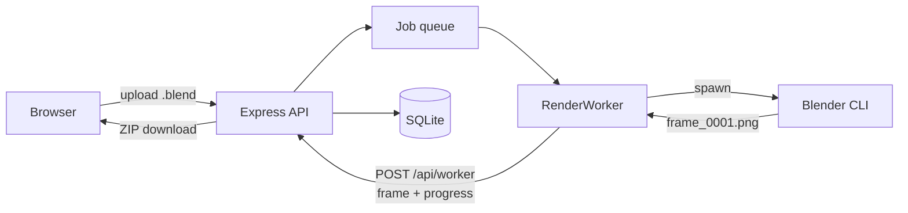

# RenderNet

A self-hosted Blender render farm: submit `.blend` files through a web interface, have them rendered frame-by-frame by a background worker, and download the results as a ZIP.

---

## Overview

RenderNet accepts `.blend` uploads from authenticated users, queues them, and drives Blender's CLI to render each frame. The renderer runs as a separate `RenderWorker` that reports progress back to the API over HTTP rather than through in-process callbacks — the same boundary a worker on another machine would use, which is what makes distributed rendering the natural next step.

Jobs and sessions are persisted in SQLite, so a restart or crash does not lose work: interrupted renders are requeued automatically.

---

## Architecture



The worker renders one frame at a time and uploads each as it finishes, so progress is visible during long jobs and a failure costs one frame rather than the whole range. It authenticates with a shared secret (`WORKER_SECRET`) since it has no user session of its own.

---

## Features

- Upload `.blend` files and render a chosen frame range remotely
- Token-based authentication with user and admin roles
- Single-worker job queue with live progress and per-frame error reporting
- Cancel queued or in-flight jobs (terminates the running Blender process)
- Download finished renders individually or as a ZIP
- Jobs and sessions survive restarts; interrupted renders resume automatically
- Automatic cleanup of uploads, renders and job records after 48 hours

---

## Tech Stack

**Backend** — Node.js, Express, SQLite (`better-sqlite3`), Multer, Archiver, Blender CLI

**Frontend** — Vanilla JavaScript, HTML and CSS (dark theme), no framework or build step

---

## Installation

### Prerequisites

- Node.js 20 or later (required by `better-sqlite3`)
- Blender installed and on your `PATH`
- npm

### Setup

1. **Clone and install**

   ```bash
   git clone https://github.com/Vishrut2403/RenderNet.git
   cd RenderNet/backend
   npm install
   ```

2. **Create `backend/.env`**

   ```env
   PORT=5500
   WORKER_SECRET=change-me-to-a-long-random-string
   ```

   `.env` must live in `backend/`, not `backend/src/` — `dotenv` resolves it from the working directory.

3. **Start the server**

   ```bash
   npm start        # or: npm run dev
   ```

4. **Serve the frontend**

   ```bash
   cd ../frontend
   npx http-server -p 8080
   ```

   The frontend has no dependencies and needs no build step. If you serve it on a different port or host, update `API_URL` in `frontend/js/config.js`.

### First login

A default admin account is created on first run:

| Username | Password |
| --- | --- |
| `admin` | `admin123` |

**Change this immediately** if the instance is reachable by anyone else.

---

## Configuration

All settings are environment variables read from `backend/.env`.

| Variable | Default | Purpose |
| --- | --- | --- |
| `PORT` | `5500` | API listen port |
| `WORKER_SECRET` | *generated per process* | Shared secret authenticating worker callbacks. Must be set explicitly for workers on other machines; otherwise a random one is generated at boot and only the in-process worker can authenticate. |
| `DB_PATH` | `rendernet.db` | SQLite database file |
| `BLENDER_PATH` | auto-detected | Blender executable, if not on `PATH` |
| `CYCLES_DEVICE` | `CPU` | Cycles render device: `CPU`, `CUDA`, `OPTIX`, `HIP`, `ONEAPI`, `METAL` |
| `API_URL` | `http://localhost:5500` | Base URL the worker posts results back to |

---

## Usage

1. Sign up, or log in as `admin`
2. Upload a `.blend`, choose a frame range and a render engine
3. Watch status and progress on the dashboard
4. Download the finished frames as a ZIP

Supported engines: `CYCLES`, `BLENDER_EEVEE`, `BLENDER_WORKBENCH`. Uploads are limited to `.blend` files up to 500MB and a range of 2000 frames.

---

## API

All routes are prefixed with `/api`. Unless noted, they require an `Authorization: Bearer <token>` header.

### Auth

| Method | Route | Notes |
| --- | --- | --- |
| `POST` | `/auth/signup` | Public |
| `POST` | `/auth/login` | Public; returns a token valid for 24 hours |
| `GET` | `/auth/verify` | Checks a token; responds `401` if missing or expired |
| `POST` | `/auth/logout` | |
| `POST` | `/auth/change-password` | |
| `GET` | `/auth/users` | Admin only |
| `POST` | `/auth/admin/reset-password` | Admin only |

### Jobs

| Method | Route | Notes |
| --- | --- | --- |
| `POST` | `/upload` | Multipart: `blend`, `frameStart`, `frameEnd`, `renderEngine` |
| `GET` | `/jobs` | Own jobs; admins see all |
| `GET` | `/jobs/:id` | |
| `POST` | `/jobs/:id/cancel` | |
| `GET` | `/jobs/queue/status` | |

### Downloads

Accept a token either as a header or as a `?token=` query parameter, so frame URLs can be used directly in `` tags.

| Method | Route |
| --- | --- |
| `GET` | `/download/:id/files` |
| `GET` | `/download/:id/zip` |
| `GET` | `/download/files/render_:id/:filename` |

### Worker callbacks

Authenticated with an `x-worker-secret` header instead of a user token.

| Method | Route |
| --- | --- |
| `POST` | `/worker/jobs/:id/frames/:frame` |
| `POST` | `/worker/jobs/:id/frames/:frame/failed` |
| `POST` | `/worker/jobs/:id/progress` |
| `POST` | `/worker/jobs/:id/complete` |

---

## Testing

```bash
cd backend
npm test
```

Two suites run in sequence:

- **Worker callback endpoints** — the callback API exercised in-process against the real queue. Blender is never spawned, so this runs anywhere.
- **API, rendering and persistence** — a real server instance covering upload validation, ownership and access control, admin routes, an actual Blender render, downloads, and recovery across a restart.

Each suite runs in its own temporary directory with a separate database, so tests never touch real uploads, renders or user accounts. Render-dependent checks are skipped automatically when Blender is not installed, leaving 34 of the 45 checks still meaningful on a machine without it.

---

## Reliability

**Persistence.** Jobs and sessions are written to SQLite as they change. Restarting the server preserves job history, progress and login sessions.

**Crash recovery.** A job left mid-render by a restart has no worker behind it, so it is reset and requeued on the next boot. Jobs interrupted more than twice are marked failed rather than retried forever.

**Cleanup.** Every 24 hours, uploads, render output, worker scratch files and job records older than 48 hours are deleted, along with expired sessions.

---

## Known Limitations

Worth being explicit about, since this is a personal project rather than production software:

- **Password hashing is unsalted SHA-256.** Adequate for a local instance, not for anything internet-facing; bcrypt or argon2 is the correct choice.
- **Users are stored in `users.json`** while jobs and sessions live in SQLite — an inconsistency left over from an earlier iteration.
- **One worker at a time.** The queue renders strictly sequentially; the HTTP callback boundary exists so this can change, but multi-worker dispatch is not implemented.
- **A resumed job re-renders from the first frame** rather than continuing where it stopped.
- **The frontend has no automated coverage** — the test suite exercises the API only.

---

## Roadmap

- Multi-worker dispatch across machines
- WebSocket progress updates in place of polling
- Resume interrupted jobs from the last completed frame
- bcrypt password hashing and a single storage backend

---

## Contributing

Built as an individual portfolio project. Feedback and suggestions are welcome.
