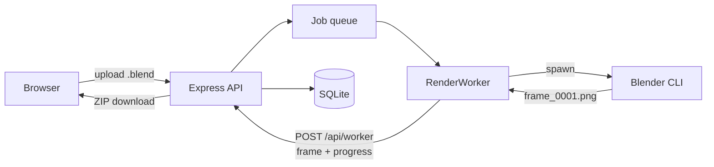

# RenderNet

[](https://github.com/Vishrut2403/RenderNet/actions/workflows/ci.yml)

A self-hosted Blender render farm for a shared workstation. One machine does the
rendering; everyone else submits `.blend` files from a browser with nothing to
install and collects the finished frames as a ZIP or a video. It spreads a job
across as many machines as you point at it, bakes whatever simulations the scene
needs before rendering it, holds a test frame back for approval if you ask, and
picks up where it left off when the workstation is switched off mid-render.




## Setting it up

On the machine that renders, which needs **Node.js 22 or newer** and **Blender**:

```bash
git clone https://github.com/Vishrut2403/RenderNet.git
cd RenderNet && ./start.sh
```

That is the whole of it. The script installs what is missing, builds the page the
browser gets, starts the farm, and prints the address to open and the code for
creating an account. Run it again whenever you want the farm up; Ctrl+C stops it.

Everybody else opens that address, creates an account with that code, and uploads
a scene. A browser is the whole client.

To make another machine render as well, clone this there and point it at the
farm. It needs Blender too, and an admin to issue it a credential when it asks:

```bash
./join.sh http://rendernet.local:5500
```


