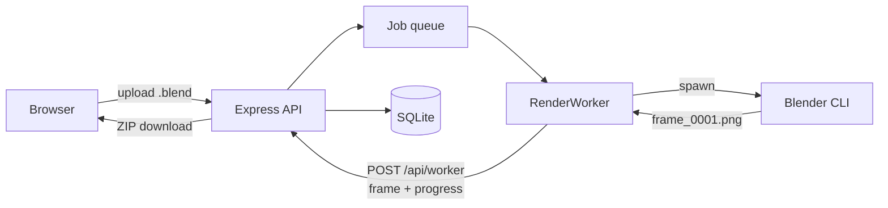

# RenderNet

[](https://github.com/Vishrut2403/RenderNet/actions/workflows/ci.yml)

A self-hosted Blender render farm for a shared workstation. One machine does the rendering; everyone else submits `.blend` files and collects finished frames from a browser, with nothing to install.




The renderer runs as a separate `RenderWorker` reporting back over HTTP rather than through in-process callbacks — the same boundary a worker on another machine would use.

---

## What it does

- Takes a `.blend` from a browser — engine, frame range and step, resolution,
  samples, output formats — and hands the frames back as a ZIP or as a video.
- Spreads a job across as many machines as you point at it, in spans of frames.
- Splits a single heavy still into tiles rendered at once and puts it back together.
- Renders one frame first and holds the rest until its owner approves it.
- Opens a scene as soon as it is chosen, to fill the form in from it and to
  see whether it brought its textures.
- Survives the workstation being switched off mid-render.
- Accounts, per-user disk quotas, per-machine credentials, scoped download
  links, and HTTPS when you give it a certificate.

---

## How it works

The parts that took the most thought.

**Frames are claimed, not handed out.** A worker asks for work and holds a claim
on it with an expiry, renewed while it renders. A worker that dies loses the
claim and the frames return to circulation — at once for a renderer on this
machine, since the pool that started it knows the moment it goes, and when the
term runs out for one somewhere else. Only the holder may upload, and what
arrives is checked against the format it is named as before it counts: a render
cut short leaves a file with the right name and the wrong bytes, which nothing
downstream would notice until somebody opened the ZIP. A renderer on the
server's own machine hands over the path instead of the bytes, since the file is
already on a disk the server can read — only a machine using the credential this
server mints for itself may do that, and it falls back to sending the file if
the server will not take it. The server decides when a
job is done, not the worker — a worker that died halfway is in no position to
report.

**A claim covers a span of frames, not one.** Starting Blender costs the same
seconds of parsing and scene building whether it then renders one frame or ten:
on this repository's own fixture, five separate launches take 8.5s against 2.0s
for one launch of five frames. So a claim covers as many frames as fit in
`FRAME_SPAN_MS`, measured against what a frame of *this job* has cost *this
machine*. Every machine's first claim on a job is a single frame, because
rendering one is the only thing that says what the scene costs it; after that a
slow scene is still claimed a frame at a time and a fast one in handfuls, a
laptop is given less to hold than the workstation beside it, and a span is never
more than one machine's share of what is left. Comparing a machine's recent rate
against the farm's looked like it would skip that first frame, and does not: the
two medians are taken over different sets of frames, so whichever machine
rendered most of them lately pulls both towards itself and every machine reads
as average. CI caught that as a laptop being handed eight frames where three was
the honest number. Frames go back as Blender writes them rather than when the
launch ends, so a span cut short keeps everything it had already rendered, and
only the frame Blender actually stopped on is charged a failed attempt.

**And that launch is not paid once a claim either.** Blender is kept running
between claims and fed the next span over its own standard input, so a worker
that keeps claiming from one job parses the scene and builds its acceleration
structure once rather than once a span. Six frames of the fixture as three
claims take 11.64s a launch at a time against 9.20s through one Blender, startup
included. It is reused only when the command line and environment would have
been identical, so everything that used to be decided at launch - the scene, the
engine, the output pattern, the region of a tile - still is; anything else
starts a new one. A held Blender holds the scene in memory with it, so it is let
go after `BLENDER_IDLE_MS` with nothing to render, and setting that to 0 closes
it after every span.

**Frames are claimed spread out, not in order.** A range rendered from its start
means the artist watches the first seconds of a shot appear and learns nothing
about the rest until it is nearly done. Frames are claimed in bit-reversed order
instead - the first frame, then the middle one, then the quarters - so a job an
eighth of the way through is an even sample of the whole range, and a camera
that goes wrong at frame 400 is seen while there is still something to be done
about it. The first frame is still claimed first, which is what measures every
span after it and what a test frame renders. It costs a little: on this
repository's fixture, twelve frames scattered across a range take about 3% longer
than twelve consecutive ones, because each frame is a bigger step for Blender to
re-evaluate - a share that shrinks as frames get heavier, and `FRAME_ORDER=sequential`
gives the old order back. Each claim's own frames are still handed to Blender in
ascending order.

**A scene is stored by what is in it.** An upload is kept under the SHA-256 of
its bytes, at `uploads/<hash>/<the name it was given>`, so submitting the same
file again — a second frame range of one shot, a re-run after a failure, two
people handed the same scene — is the copy already on disk rather than another
one. It is charged against the artist's quota once however many of their jobs
render it, and two people who send the same file are charged separately, because
a quota nobody can predict is not a quota. The awkward part is the lifetime: a
file that outlives any one job may only be deleted by the last job that could
still render it, which is what cancelling, deleting and the retention sweep all
have to agree on. A machine rendering somewhere else keeps its own copy under
the same hash, so it downloads a scene once however many jobs of it it renders.

**The disk reserve is kept while a job runs, not only before it starts.**
`MIN_FREE_BYTES` is what stops the disk ever actually filling, and a long render
used to walk straight through it: nothing looked at free space between the
moment a job started and the moment it ended, so the back half of the range
failed three attempts at a time against a disk with no room. Free space is now
read as frames land, and a job that has eaten into the reserve goes back to the
queue keeping every frame it delivered.

**A scene is checked for what would render it wrongly, not just for what would
stop it.** Three things come back from opening it. Files it reaches for and did
not bring stop the job before a frame is spent — and then the farm asks for
them rather than refusing the whole thing. The scene is already on the disk and
is one texture short; making somebody pack a two gigabyte file and send it again
to supply five megabytes is the cost being avoided. Each file is handed over on
its own, kept with the job that supplied it rather than pooled, and the `.blend`
is never rewritten: the render points that datablock at the copy it was given,
so the scene keeps its hash and stays shared with every other job that renders
it. Blender renders a texture it cannot find as magenta and reports success, so
the check is the only thing standing between that and a finished job.

The scene is looked at again once the last file arrives, rather than queued on
the strength of the first answer. A linked `.blend` is the reason: it cannot be
packed into the scene that links it — `Pack Resources` collects images, sounds
and fonts and leaves libraries where they are — and until it has been supplied
Blender cannot open it to see what it reaches for in turn. So supplying one can
turn up a second round of missing files, and a job queued without looking again
would render half dressed and call itself finished.
Files that are *here but not packed into it* are subtler: a machine somewhere
else is sent the `.blend` and nothing beside it, so that job is kept on the
machine that can see them rather than rendered untextured elsewhere and called
done. Somebody who means it can tick the box and skip the lot.

**A simulation nobody baked is dealt with here.** The farm hands frames out side by
side and out of order, and every launch of Blender is a fresh one, which a cache
stepped as it renders cannot survive — rendering frame 24 of an unbaked cloth
sim on its own gives a picture 15% of whose pixels are wrong. So a job whose
scene has an unbaked cloth, soft body, particle or rigid body cache is claimed
for baking before any of it is claimed for rendering. One machine steps every
simulation from its first frame up to the last frame the job needs, writes the
scene out again with the caches inside it, and the frames then render from that
copy — bit for bit what the artist would have got rendering the range in one
Blender at home. The bake belongs to the job: it lives in the job's own folder,
counts against its owner's quota, and is deleted with it.

A cache the artist baked themselves is left alone — but only if its frames
actually arrived. Blender can keep a baked cache in the file or in a
`blendcache_` folder beside it, and a scene uploaded on its own leaves that
folder behind while still reporting itself baked. The check asks how much each
cache is holding rather than taking the flag's word for it, so a cache that says
`0 frames on disk` is baked here like one that was never baked at all. A cache
kept on disk is brought into the file while it is at it, since a folder beside
the scene cannot travel with the copy the bake saves.

Two simulations are sent back rather than baked, because baking them here would
deliver a picture the artist would not get themselves. One is on an object
*linked* from another file: its cache belongs to that file and is never written
into the scene linking it, so the bake would report success and be gone the
moment the scene was reopened. The other is on an object switched off in the
viewport — Blender bakes nothing for one of those, and stepping it as the frames
render gives a third picture, matching neither the artist's render nor a proper
bake. Both jobs come back naming the object and the setting to change.

**Smoke, fire and liquid are the same story with none of the same mechanics.**
A Mantaflow cache is a folder of files the scene merely points at, and the path
it points at is the artist's own machine — Blender's default is a directory
under `/tmp`. So an uploaded scene almost never brings its fluid with it, and
nothing in the file says so: the domain's "baked" flags describe whether
somebody pressed Bake, not whether the frames are here, and a cache filled by
playing the timeline has frames and no flag. What the check reads is the folder,
for the frames this job renders.

A domain writes a folder per kind of frame it makes — the base simulation, the
noise pass over it, the mesh a liquid renders as, its spray and foam, any
guiding — and the render needs every one the domain was set up to use, so all of
them are checked. Which ones count depends on what the domain *is*: a smoke
domain reports `use_mesh` as readily as a liquid does, and a folder for it never
appears.

Filling one is its own trick, twice over. Stepping through the frames fills the
cache and gives a simulation a little ahead of the artist's; what matches, to
the pixel, is *rendering* the range — so the farm renders it at 5% of the
resolution in Workbench, which costs nothing beside the simulation itself. And a
cache repointed in a session that has already evaluated the scene simulates
something slightly its own, so the scene is saved pointing at the job's folder
and opened a second time to be filled. With both, the frames come back bit for
bit what the artist's own render produced. They land in the job's folder beside
the baked scene, and because a fluid's frames cannot live inside the `.blend`,
that job then renders only on the machine holding them.

A geometry nodes simulation zone steps frame to frame the way cloth does, and
renders the state it starts in when a frame is asked for on its own. Nothing it
exposes says whether it has been baked — the bake items read the same before and
after, and packing, unpacking and jumping to the last frame all fail to tell the
two apart — so a scene with one is baked whether or not it needed it, into the
file rather than a folder beside it.

Dynamic paint needs none of this, which is worth writing down because it looks
like it should. Asked for a frame it has no cache for, it simulates the history
up to that frame and gets the same answer every time — measured bit for bit
against a sequential render, for an end frame and a middle one, rendered
concurrently by four machines and backwards inside one. It costs a re-simulation
per Blender launch and nothing else, so the farm leaves it alone. Neither does
the ocean modifier, which is a function of its own time input rather than of the
frame before.

What counts as rendering is taken from the scene's own objects together with the
dependency graph, since neither is enough on its own: an instanced collection
brings in simulations the scene never lists, and the dependency graph is
evaluated for the viewport, so it leaves out an object hidden there and rendered
anyway.

One that was baked only part of the way is left alone, though. Blender holds a
baked cache at its last baked frame rather than stepping past it, and holds it
identically in every launch on every machine, so those frames come back from the
farm pixel for pixel as they come out at home — carrying the bake further would
render something the artist never saw.

Hair is the exception among these: its dynamics hold what a render put there and
read it back frame for frame, and baking one gives a simulation of its own — a
quarter of a percent out, and eleven percent out if the cache range is shortened
to the job. So hair is filled by rendering the range rather than baked, the way
a fluid is.

`node tools/simulations/check.mjs` is how all of this is known to hold: it builds
one scene per kind of simulation, renders each the way the artist would and the
way the farm does, and reports the difference. It wants Blender and several
minutes, so it is not part of the test suite — run it when the workstation's
Blender is upgraded, since most of what it covers is behaviour Blender never
promised.

Baking is the farm's own work, so it is claimed like anything else: a machine
switched off part way through one loses the claim rather than the job, and the
bake is offered again. It is not free — the scene is saved a second time with
its caches in it, and a heavy simulation can cost more than the render does.

**An interrupted render resumes rather than restarting.** Frames are tracked
individually, so switching the machine off mid-job costs the frame in flight,
not the evening. A job is only given up on if it is interrupted repeatedly
*without ever completing a frame*.

**Renderers are separate processes.** The server starts `WORKER_SLOTS` of them
and restarts any that die; one with nothing left to claim starts the next queued
job rather than waiting. A second machine joins by running `npm run worker`
against the same API, fetching each scene over HTTP. Every worker says which
engines it offers and is passed over for jobs using anything else.


**Every machine renders under its own credential.** The workstation mints one
for itself at each start, so it needs nothing configured; every other machine is
issued one that is shown once and can be revoked on its own. A machine may only
touch the claims it holds, and may only download the scenes it is rendering.

**The queue is shared out rather than served in order.** Every owner has a clock
measured in farm time, and a job joining the queue is stamped with where its
owner's clock reaches once that job has rendered; the queue runs in stamp order.
Somebody who has already asked for an hour of the machine waits behind somebody
who has asked for a minute, however many jobs each of them submitted, and the
cost is taken from frames actually measured on this farm rather than guessed at.
Nobody is billed for last week: once nothing is queued or rendering the clocks
are cleared. An urgent job still goes in front of all of it.

The wait each queued job is promised is costed the same way, job by job, rather
than at the farm's average frame: what is ahead of you is those jobs' frames,
and scenes differ by orders of magnitude. Costing it at the farm's median told
somebody they would start in 165ms when the five frames ahead of them took two
seconds each. The farm's rate is kept for a job that has never rendered and so
has nothing of its own to go on.

**An admin can override the answer.** Holding a job stops it and keeps it
stopped — it goes back to the queue with the frames it has already rendered and
is not started again until the same admin releases it. Pinning one puts it in
front of the entire farm, urgency and turns included, and pauses whatever is
rendering to get there. Both are admin-only; an owner can still mark their own
job urgent, which is as far as their reach goes.

**A heavy still can be split across machines.** A single frame submitted in
tiles is cut into regions, each claimed and rendered like any other unit of
work. Putting them back together is a unit of work too, claimed the same way:
the machine that takes it reads the regions off the disk if it is the server's,
and fetches them over HTTP if it is not. That matters on a farm whose server
only coordinates — with `WORKER_SLOTS=0` it need not have Blender at all, and
assembly used to be the one thing it insisted on doing itself. Splitting a still
only pays off with more than one machine free: on one workstation it is the same
work with more steps.

**The form fills itself in from the scene.** A file is sent the moment it is
chosen rather than on submit, so the workstation can open it in Blender while
the rest of the form is being filled in, and answer with the frame range,
engine, resolution, step, samples and format the scene was saved with. A field
the artist has already set is left alone. Anything this farm cannot honour — an
engine it does not run, a scene with no camera — is said rather than quietly
dropped. Submitting queues the file already on disk,
so it goes up once.

**A test frame can be rendered first.** The rest of the range is held back until
its owner has looked at that frame and approved it, so a wrong camera or a
missing material costs one frame rather than five hundred. The farm renders
whatever is queued behind it while it waits.


**The list is paged and big uploads are chunked.** Jobs are read twenty-five at
a time through a cursor on the job id rather than an offset, so a job arriving
mid-scroll cannot push a row into view twice; the filter counts are worked out
over every job, so they stay right whatever is on screen. A file over 32MB goes
up in pieces, each answered with how much the server now holds, so a transfer
that dies carries on from that byte.

---

## Setting up the workstation

Needs **Node.js 22 or newer** and **Blender**. Not 20, even though it is still LTS: `better-sqlite3` publishes no prebuilt binary for Node 20, so installing it compiles from source and needs a C++ toolchain — on Windows that means Visual Studio with the Desktop C++ workload. On 22 and 24 the binary is downloaded and nothing is built.

**1. Build it**

```bash
git clone https://github.com/Vishrut2403/RenderNet.git
cd RenderNet/backend && npm install
cd ../frontend && npm install && npm run build
```

The frontend build is what lets clients get away with only a browser — the API serves `frontend/dist` itself. Rebuild after changing frontend code.

**2. Write `backend/.env`**

```env
PORT=5500
SIGNUP_CODE=what-you-tell-your-team
BLENDER_PATH=C:\Program Files\Blender Foundation\Blender 5.2\blender.exe
```

Copy `backend/.env.example`, which carries every option and its default, rather
than typing this out. `BLENDER_PATH` is required on Windows and optional
wherever `blender` is on `PATH`.

Nothing needs to be said about the graphics card. Each renderer asks its Blender
which Cycles backends it can reach and takes the fastest, so a machine with an
RTX card renders on OPTIX without being told to. `CYCLES_DEVICE` overrides that:
`CPU` keeps the card free for whoever is sitting at the machine, and naming a
backend the machine has not got is reported on the dashboard and rendered on
what it does have, rather than failing every frame the way Blender would.

**Without `SIGNUP_CODE` nobody can create an account** — deliberate, since
anyone who can reach the port could otherwise sign up, but it has to be set
before your team can register.

**3. Start it** with `npm start` from `backend/`. The output tells you whether
step 2 worked — it names the Blender it found, the data directory and the URL.

**4. Take the admin account.** Sign in as `admin` / `admin123`. It immediately
requires a new password and refuses everything else until one is set — that is
the intended path, not a fault, and the same applies to anyone whose password an
admin resets later. Five wrong passwords lock a username out for fifteen
minutes; restarting the server clears it.

---

## Windows: three settings and a startup task

**Open the port**, or nobody else can connect. As administrator:

```
netsh advfirewall firewall add rule name="RenderNet" dir=in action=allow protocol=TCP localport=5500
```

**Stop it sleeping** mid-render:

```
powercfg /change standby-timeout-ac 0
powercfg /change hibernate-timeout-ac 0
```

**Rename the PC** to something like `RENDERNET`, so people can use
`http://rendernet:5500` rather than chasing a DHCP address.

**Start on boot** — Task Scheduler, Create Task:

| Field | Value |
| --- | --- |
| Trigger | At log on |
| Action | Start a program |
| Program | `C:\Program Files\nodejs\node.exe` |
| Arguments | `C:\RenderNet\backend\src\index.js` |
| Settings | tick *If the task fails, restart every 1 minute* |

Use `node.exe` rather than `npm`, a `.cmd` wrapper that behaves awkwardly under
Task Scheduler, and *At log on* rather than *At startup*, which keeps the server
in the interactive session where GPU rendering behaves as it does by hand. The
working directory does not matter: data paths and `.env` resolve from the source
tree. The database is snapshotted to `backups/` on every start, keeping seven.

Nothing reads that window, so everything printed also goes to a dated file in
`logs/` under the data directory, kept for a month, with a line per request
recording who did what. The job list the dashboard polls is left out, or it
would be the whole file. An admin reads them from the Logs entry in the account
menu, or over the API at `GET /api/logs`.

---

## Setting up a client

Nothing to install.

1. Open `http://rendernet:5500`
2. **Create account** — username, password, and the signup code
3. Sign in and upload a `.blend`


Jobs belong to the account rather than the machine, so someone can submit from one
computer and download from another.

Everything the farm carries — passwords, session tokens, whole scenes — crosses
the network, so on anything but a trusted wire give the server a certificate:

```
openssl req -x509 -newkey rsa:2048 -nodes -days 825 \
  -keyout tls-key.pem -out tls-cert.pem \
  -subj "/CN=rendernet" -addext "subjectAltName=DNS:rendernet"
```

Point `TLS_KEY` and `TLS_CERT` at the two files and the same port serves HTTPS.
A self-signed certificate means each browser is warned once; a worker on another
machine needs `NODE_EXTRA_CA_CERTS=/path/to/tls-cert.pem` to trust it.

To confirm the workstation is reachable, open `http://rendernet:5500/api/health`
from a *different* machine: `{"status":"ok","blenderAvailable":true}` means the
firewall rule and the name both work, and `degraded` means Blender is missing or
the disk is too full to render. Signed in it also carries the queue depth, free
disk, every job in flight with the worker holding each frame, and the last
failure — one URL answering "is the farm working?" rather than "is the process
up?".

---

## Configuration

Environment variables, read from `backend/.env`. It is resolved from the source
tree, so it is found however the server is started.

| Variable | Default | Purpose |
| --- | --- | --- |
| `PORT` | `5500` | API and UI listen port |
| `SIGNUP_CODE` | *unset* | Code required to create an account. While unset, account creation is refused rather than left open. |
| `WORKER_TOKEN` | *minted at start* | Credential a worker authenticates with. Needed only on other machines; issue one under Admin. |
| `WORKER_SECRET` | *unset* | The old farm-wide secret. Still accepted, and listed under Admin so it can be revoked once every machine has its own. |
| `BLENDER_PATH` | auto-detected | Blender executable. Required on Windows. |
| `CYCLES_DEVICE` | the fastest device Blender offers | `CPU`, `CUDA`, `OPTIX`, `HIP`, `ONEAPI` or `METAL`. Cycles only |
| `ALLOWED_ORIGINS` | *unset* | Origins allowed to call the API from a browser, comma-separated. Unset means same-origin only. |
| `TLS_KEY` / `TLS_CERT` | *unset* | Private key and certificate. Set both to serve HTTPS; setting one alone stops the server rather than quietly serving plain HTTP. |
| `DATA_DIR` | the `backend/` directory | Where uploads, renders, scratch space and the database live |
| `USER_QUOTA_BYTES` | `10737418240` (10 GB) | Disk each user may hold in uploads and rendered frames |
| `MAX_UPLOAD_BYTES` | `2147483648` (2 GB) | Largest scene a chunked upload may carry |
| `MAX_FRAME_BYTES` | `536870912` (512 MB) | Largest single frame a worker may send back. A 4K OpenEXR with several passes is not small. |
| `TRUST_PROXY` | *unset* | Set when a reverse proxy sits in front, to the number of proxies or to what Express accepts. Without it every request looks like it came from the proxy, so a lockout keyed on the caller locks everybody. |
| `RETENTION_DAYS` | `14` | Backstop sweep for files nobody came back for |
| `MIN_FREE_BYTES` | `5368709120` (5 GB) | Disk kept spare; below it uploads are refused and the queue holds |
| `DB_BACKUPS_KEPT` | `7` | Database snapshots kept in `backups/`, one taken per start |
| `LOG_RETENTION_DAYS` | `30` | How long dated logs in `logs/` are kept |
| `MAX_LOG_BYTES` | `8388608` (8 MB) | Size at which the day's log rotates to a new file |
| `DB_PATH` | `rendernet.db` inside `DATA_DIR` | SQLite database file |
| `API_URL` | `http://localhost:5500` | Base URL the worker posts results back to |
| `WORKER_SLOTS` | `1` | Renderers this machine runs, each its own process. `0` coordinates only |
| `WORKER_ENGINES` | what Blender lists | Engines this machine will accept frames for, comma-separated. Narrow it where an engine cannot render headless |
| `WORKER_REMOTE` | *unset* | Set to `1` on a worker not on the server's machine |
| `WORKER_SCRATCH_DIR` | a temp directory | Where a remote worker keeps scenes and frames |
| `FRAME_SPAN_MS` | `60000` | How much rendering one claim may cover, so the cost of starting Blender is spread over several frames |
| `MAX_FRAME_SPAN` | `16` | Most frames one claim may cover, whatever the time budget allows |
| `BLENDER_IDLE_MS` | `60000` | How long a Blender with nothing to render is kept open for the next claim. `0` closes it after every span, for a machine short of memory |
| `FRAME_ORDER` | `spread` | Order a job's frames are claimed in. `spread` samples the whole range early; `sequential` renders it from the start |
| `LEASE_TTL_MS` | `30000` | How long a worker's claim on a frame lasts before another may take it. A frame whose machine has gone is stranded until it runs out. |
| `PREFLIGHT_TIMEOUT_MS` | `120000` | How long the pre-render scene check may take before the job is queued anyway |
| `FFMPEG_PATH` | auto-detected | ffmpeg executable, for making a video of the frames. Without it that button says so |
| `VIDEO_FPS` | `24` | Frame rate for those videos |

---

## Development

```bash
cd frontend && npm run dev     # Vite on :8080, proxies /api to the backend
cd frontend && npm test        # 55 checks, Vitest and Testing Library
cd backend  && npm test        # 705 checks
npm run lint                   # from the root, covers both packages
```

`npm run demo` from the root brings up a farm to look at — its own data
directory and database, filled on first run with a job in every state the UI can
show, from a turntable scene under `tools/demo/`. It runs in the foreground, so
Ctrl+C stops it; `npm run demo:seed` adds more work and `npm run demo:reset`
throws it all away.

Set `VITE_PROXY_TARGET=http://host:5500` to point the dev server at a backend
elsewhere. Tests run in temporary directories with their own databases and never
touch real uploads, renders or accounts. A stand-in for Blender covers everything
that only needs frames on disk, so without a real one installed a handful of
checks skip themselves and the rest runs — what skips is what only Blender
itself can answer, which is why CI installs one. The
frontend's own tests cover what the browser does with the API rather than how it
looks: chunked upload and its resume, the paged job list, and which actions a
job card offers in which state.

One suite is about installing a release rather than running one. Every other
suite starts from an empty database, so nothing else ever runs a migration
against rows somebody already had — which is the state every real workstation
is in. It renders a job partway, takes the database back to the previous
release's shape, starts the new one on it, and checks that a job already queued
is carried over and finished in the order it was always going to be rendered in
rather than resequenced underneath whoever is waiting on it.

CI runs the whole suite on Linux and Windows against Node 22 and 24 — the only
place it meets the platform the workstation actually runs. Windows differs where
it matters most: with no signals, cancelling a render means killing a process
tree with `taskkill` rather than escalating SIGTERM to SIGKILL. That path and the
quoting that carries a Blender path through `cmd.exe` are also checked directly
from any OS, so a mistake in either shows up before CI does.

A further pair of jobs installs a pinned Blender — on Linux and on Windows, the
platform the workstation actually is — and runs the suite again, on every push
and every pull request. That is where the checks on what Blender itself writes
run: the formats, what opening a scene reports, a Blender kept open across
several claims. The download is cached against its version, so it is paid once
per Blender rather than once per run.

Those jobs set `REQUIRE_TOOLS=blender,ffmpeg`, because a check that skips itself
still passes: a Blender that stopped being found would otherwise take every
render-dependent check out of the run and leave the badge green. Naming a tool
turns a skip for want of it into a failure, while leaving alone the skips that
are about what a machine can do — an engine that will not render headless is a
fact about the runner, not a broken install.

---

Built as an individual portfolio project. Feedback and suggestions are welcome.
